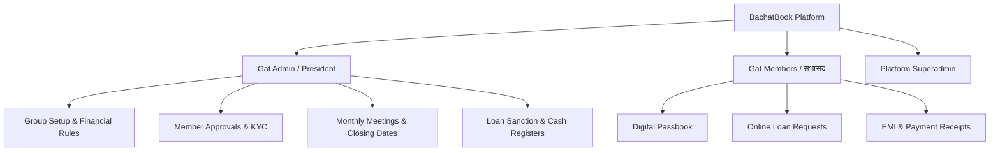
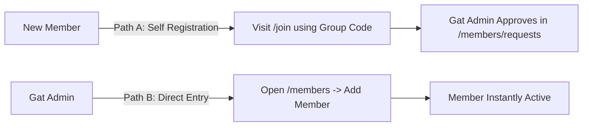
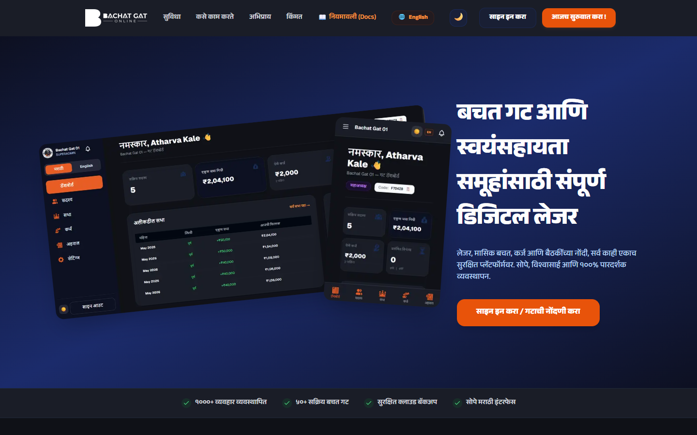

# BachatBook (बचत बुक) — Complete User Manual & Documentation
> **Digital Accounting & Management Platform for Self-Help Groups (SHGs) & Bachat Gats**  
> *महिला बचत गट व स्वयंसहाय्यता समूहांसाठी संपूर्ण डिजिटल कार्यप्रणाली*

---

## 📌 Quick Access & Demo Credentials (प्रात्यक्षिक खाती)

Use these pre-configured demo credentials to explore, test, and demonstrate every workflow on the live platform:

* **Live Application URL**: [https://bachat-gat-online.vercel.app/](https://bachat-gat-online.vercel.app/)
* **Demo Group Code (गट कोड)**: `TEJAS1`
* **Demo Bachat Gat Name**: तेजस्विनी महिला बचत गट (Tejaswini Mahila Bachat Gat)

| Role (भूमिका) | Name (नाव) | Phone (फोन नंबर) | Group Code | Password | Status & Notes |
| :--- | :--- | :--- | :--- | :--- | :--- |
| **Gat Admin / President** | सुनिता पाटील | `9876500001` | *Optional* | `Password@123` | Full administrative control of meetings, loans, and members. |
| **Active Member (with Loan)** | अनिता जोशी | `9876500002` | `TEJAS1` | `Password@123` | Member with active ₹10,000 loan & EMI schedule. |
| **Regular Member** | प्रिया कांबळे | `9876500003` | `TEJAS1` | `Password@123` | Regular member with savings history. |

---

## 📑 Table of Contents (अनुक्रमणिका)

1. [System Architecture & Roles (प्रणाली रचना आणि भूमिका)](#1-system-architecture--roles)
2. [Module 1: Creating & Registering a New Bachat Gat (नवीन गट नोंदणी)](#module-1-creating--registering-a-new-bachat-gat)
3. [Module 2: Member Management & Joining (सदस्य जोडणे व सामील होणे)](#module-2-member-management--joining)
4. [Module 3: Member KYC & Verification (केवायसी दस्तऐवज पडताळणी)](#module-3-member-kyc--verification)
5. [Module 4: Monthly Meetings & Ledger (मासिक सभांचे व्यवस्थापन)](#module-4-monthly-meetings--ledger)
   - 4.1 [Opening Balance: First Meeting vs Subsequent Meetings](#41-opening-balance-first-meeting-vs-subsequent-meetings)
   - 4.2 [Draft Meeting Lock Protection](#42-draft-meeting-lock-protection)
   - 4.3 [Conducting a Meeting & Collecting Savings](#43-conducting-a-meeting--collecting-savings)
   - 4.4 [Meeting Finalization & Closing Date Record](#44-meeting-finalization--closing-date-record)
6. [Module 5: Loans & EMI Management (कर्ज वाटप व परतफेड)](#module-5-loans--emi-management)
7. [Module 6: Digital Member Passbook (डिजिटल पासबुक)](#module-6-digital-member-passbook)
8. [Module 7: Financial Registers & Reports (नोंदवह्या व अहवाल)](#module-7-financial-registers--reports)
9. [Module 8: Troubleshooting & Frequently Asked Questions (FAQ)](#module-8-troubleshooting--frequently-asked-questions)

---

## 1. System Architecture & Roles



### Supported User Roles:
1. **Gat Admin / President (गट अध्यक्ष / सचिव)**:
   - Registers the Bachat Gat, sets monthly contribution rates, interest rates, and loan limits.
   - Conducts and finalizes monthly meetings.
   - Approves loans, tracks EMI collections, and views group-wide audit reports.
2. **Gat Member (बचत गट सदस्य)**:
   - Views personal savings passbook, attendance history, and active loans.
   - Applies for loans online with custom tenure and purpose.
   - Uploads KYC documents and payment proofs.
3. **Platform Superadmin (प्लॅटफॉर्म व्यवस्थापक)**:
   - Oversees all registered Bachat Gats across talukas and districts.

---

## Module 1: Creating & Registering a New Bachat Gat
*नवीन बचत गटाची नोंदणी कशी करावी?*

### Step 1.1: Access Registration
1. Navigate to the homepage: [https://bachat-gat-online.vercel.app/](https://bachat-gat-online.vercel.app/)
2. Click **"Register Group / गटाची नोंदणी करा"** or go directly to `/onboarding`.

> **[📸 Screenshot Placeholder: `docs/screenshots/01_landing_page.png`]**  
> *(Homepage showing 'Register Group' and 'Sign In' options)*

### Step 1.2: Enter Group Details & Financial Parameters
Fill in the official details of the Bachat Gat:

| Field Name | English Description | Marathi Label | Example Value |
| :--- | :--- | :--- | :--- |
| **Organization Name** | Official name of group | गटाचे नाव | तेजस्विनी महिला बचत गट |
| **Village / Town** | Village or area | गाव / परिसर | शिवाजी नगर |
| **Taluka** | Administrative block | तालुका | पुणे शहर |
| **District** | District name | जिल्हा | पुणे |
| **Monthly Savings** | Fixed deposit per member | दरमहा बचत रक्कम | ₹500 |
| **Default Interest** | Monthly loan interest rate | डीफॉल्ट व्याज दर | 2.0% per month |
| **Default Penalty** | Fine for missed meeting | दंड रक्कम | ₹50 |
| **Max Loan Limit** | Maximum loan per member | कमाल कर्ज मर्यादा | ₹50,000 |
| **Admin Name** | President / Lead contact | अध्यक्षांचे नाव | सुनिता सुरेश पाटील |
| **Admin Phone** | 10-digit mobile number | मोबाईल नंबर | 9876500001 |
| **Password** | Secure login password | पासवर्ड | Password@123 |

> **[📸 Screenshot Placeholder: `docs/screenshots/02_onboarding_form.png`]**  
> *(Filled registration form with financial parameters and admin credentials)*

### Step 1.3: Save & Receive Unique Group Code (गट कोड)
1. Click **"Register Bachat Gat / बचत गट नोंदणी करा"**.
2. Upon successful registration, the system automatically issues a unique 5-6 character **Group Code (e.g. `TEJAS1`)**.
3. **Important**: Note down this Group Code. Members will use it to join this specific Gat.
4. The system immediately redirects the Admin to the **Gat Dashboard (`/dashboard`)**.

> **[📸 Screenshot Placeholder: `docs/screenshots/03_group_code_success.png`]**  
> *(Success modal displaying the newly generated Group Code `TEJAS1`)*

---

## Module 2: Member Management & Joining
*गटात नवीन सदस्य कसे जोडावे किंवा सामील कसे व्हावे?*

There are **two ways** members can be added to a Bachat Gat:



### Method A: Admin Adds Member Directly
1. Log in as Gat Admin and select **Members / सदस्य** (`/members`) from the sidebar.
2. Click **"+ नवीन सदस्य जोडा / Add Member"**.
3. Provide:
   - Full Name (English & Marathi)
   - 10-digit Phone Number
   - Temporary Password (e.g., `Password@123`)
   - Address and Joining Date
4. Click **"Save / जतन करा"**. The member account is immediately active and assigned the next sequential Member Number.

> **[📸 Screenshot Placeholder: `docs/screenshots/04_admin_add_member_modal.png`]**  
> *(Add member modal on `/members`)*

### Method B: Member Joins via Group Code (`/join`)
1. The member opens [https://bachat-gat-online.vercel.app/join](https://bachat-gat-online.vercel.app/join).
2. Enters the Gat's **Group Code (e.g. `TEJAS1`)**.
3. The app fetches and displays the Bachat Gat name (*"तेजस्विनी महिला बचत गट"*).
4. The member fills their name, phone number, and password, then submits the join request.
5. The Admin receives a notification and approves the request under **सदस्य विनंत्या (`/members/requests`)**.

> **[📸 Screenshot Placeholder: `docs/screenshots/05_member_join_page.png`]**  
> *(Member self-join screen with Group Code validation)*

---

## Module 3: Member KYC & Verification
*केवायसी दस्तऐवज पडताळणी*

To comply with self-help group financial integrity guidelines, members can upload KYC identification:

1. **Member Action (`/member/kyc`)**:
   - Member logs in with phone number and password.
   - Navigates to **माझी केवायसी (My KYC)**.
   - Uploads Aadhaar Card / PAN Card / Bank Passbook photo and enters identification numbers.
   - Submits for verification.
2. **Admin Action (`/members/[id]/kyc`)**:
   - Admin opens the member's profile.
   - Inspects the uploaded document preview.
   - Clicks **"Approve KYC / केवायसी मंजूर करा"** or rejects with a reason.
   - The member's status updates to **KYC Verified (केवायसी प्रमाणित)** with a green badge.

> **[📸 Screenshot Placeholder: `docs/screenshots/06_kyc_verification_screen.png`]**  
> *(Admin KYC review screen showing document preview and approve button)*

---

## Module 4: Monthly Meetings & Ledger
*मासिक सभांचे व्यवस्थापन व हिशोब*

Meetings form the heartbeat of a Bachat Gat. BachatBook features an automated ledger to ensure zero accounting errors.

### 4.1 Opening Balance: First Meeting vs Subsequent Meetings
*आरंभीची शिल्लक (Opening Balance) ची स्वयंचलित व्यवस्था*

* **First Ever Meeting (पहिली सभा)**:
  - The Admin opens the **New Meeting Modal**.
  - Because no prior meetings exist, the Admin enters the Gat's starting cash-in-hand (e.g. `₹10,000`).
* **Subsequent Meetings (पुढील सर्व सभा)**:
  - The system **automatically carries forward** the Closing Balance of the previous meeting.
  - The input field is locked with an info card:  
    > ℹ️ *मागील सभेची अखेरची शिल्लक: ₹11,500 (आपोआप घेण्यात आली आहे)*  
    > *(Carried forward automatically from previous meeting)*

> **[📸 Screenshot Placeholder: `docs/screenshots/07_new_meeting_modal_autofetch.png`]**  
> *(New meeting modal showing auto-fetched opening balance from previous meeting)*

---

### 4.2 Draft Meeting Lock Protection
*नवीन सभा सुरू करण्यापूर्वी आधीची सभा पूर्ण करणे बंधनकारक*

To ensure accounting continuity, **a new meeting cannot be created while a previous meeting is still in Draft status**:
- **Meeting Dashboard Alert**: A prominent banner alerts the admin if an unfinalized meeting exists.
- **Modal Lock**: Clicking "+ New Meeting" displays a warning prompt with a direct **"सभेकडे जा / Go to Draft Meeting"** button instead of allowing duplicate meeting creation.
- **Backend Guard**: `POST /api/meetings` automatically rejects creation attempts with HTTP `400` if any draft meeting exists.

> **[📸 Screenshot Placeholder: `docs/screenshots/08_draft_meeting_lock_alert.png`]**  
> *(Dashboard banner and modal alert preventing creation until draft is finalized)*

---

### 4.3 Conducting a Meeting & Collecting Savings
*सभेत उपस्थिती, बचत आणि हप्ते नोंदवणे*

Open the active meeting page (`/meetings/[id]`):

1. **Attendance & Savings Table**:
   - Lists every member with checkboxes for **Present / Absent (हजर / गैरहजर)**.
   - **मासिक बचत (Monthly Savings)**: Pre-filled with the Gat's standard rate (e.g. ₹500). Can be adjusted if a member pays multiple months.
   - **कर्ज परतफेड (Loan Repayment & Interest)**: If a member has an active loan, the system automatically pulls their pending EMI principal and interest (calculated at 2% monthly).
   - **दंड / इतर (Penalty / Other)**: Option to enter late fees or miscellaneous contributions.
2. **Expenses & Additional Income**:
   - Log meeting expenses (e.g., stationary, tea/refreshments, travel).
   - Log miscellaneous income (e.g., bank interest, registration fees).
3. **Live Totals Bar**:
   - Automatically calculates:
     $$\text{Closing Balance} = \text{Opening Balance} + \text{Total Receipts} - \text{Total Expenses}$$

> **[📸 Screenshot Placeholder: `docs/screenshots/09_meeting_conducting_table.png`]**  
> *(Meeting interface showing attendance, savings inputs, and live cash summary)*

---

### 4.4 Meeting Finalization & Closing Date Record
*सभा पूर्ण करणे (Finalize) आणि अखेर तारीख नोंद*

1. When all collections are recorded, click **"सभा पूर्ण करा / Finalize Meeting"**.
2. A confirmation modal appears requesting the **Closing Date (अखेर तारीख)**.
3. Select the date (defaults to today) and confirm.
4. The meeting status switches to **FINALIZED (पूर्ण)** and the data is permanently committed to the ledger.
5. In the **Meetings Dashboard (`/meetings`)**:
   - The desktop table features a dedicated **"अखेर तारीख / Closing Date"** column displaying the finalized date (e.g., `10 Aug 2026`).
   - Mobile cards display a formatted Closing Date row.

> **[📸 Screenshot Placeholder: `docs/screenshots/10_meetings_dashboard_closing_date.png`]**  
> *(Meetings list table highlighting status and Closing Date column)*

---

## Module 5: Loans & EMI Management
*कर्ज वाटप, व्याज आकारणी आणि हप्ते परतफेड*

### 5.1 Loan Application (कर्ज अर्ज)
* A member applies via **माझे कर्ज / My Loans (`/member/loans`)** by entering:
  - Loan Amount (up to the maximum group limit, e.g. ₹50,000)
  - Tenure (e.g. 10 months)
  - Purpose (e.g. शिवणकाम साहित्य / घरगुती व्यवसाय)
* Alternatively, the Gat Admin can issue a loan directly during a monthly meeting.

### 5.2 Monthly Interest Calculation Rule
* **Standard SHG Rule**: Interest is calculated as **2% per month** on the outstanding balance:
  $$\text{Monthly Interest} = \frac{\text{Principal} \times \text{Rate}}{100}$$
  *Example*: A loan of ₹10,000 at 2% monthly produces **₹200** monthly interest.
* The system automatically generates a complete month-by-month EMI amortization schedule.

### 5.3 Loan Approval & Repayment Tracking
1. The Admin opens **Loans / कर्ज (`/loans`)** and selects the pending application.
2. Admin reviews the member's savings history and clicks **"Approve & Disburse / कर्ज मंजूर करा"**.
3. Repayments can be logged directly during monthly meetings or recorded manually when received.

> **[📸 Screenshot Placeholder: `docs/screenshots/11_loan_approval_and_schedule.png`]**  
> *(Loan management view with EMI schedule breakdown)*

---

## Module 6: Digital Member Passbook
*सदस्यांचे डिजिटल पासबुक*

Every member has 24/7 access to their real-time financial standing:

1. Member logs in at `/auth/login` using their phone number and Group Code (`TEJAS1`).
2. Navigates to **माझे पासबुक / Passbook (`/member/passbook`)**:
   - **Total Savings (एकूण बचत)**: Sum of all approved monthly savings.
   - **Active Loans (चालू कर्ज)**: Principal outstanding and next EMI due date.
   - **Transaction History (व्यवहार इतिहास)**: Date-wise ledger of all savings, interest, fines, and payment receipts.
3. Members can also submit online payment proofs (UPI screenshot / transaction ID) via **Payment Proofs (`/member/payments`)**.

> **[📸 Screenshot Placeholder: `docs/screenshots/12_member_passbook_view.png`]**  
> *(Member passbook interface showing savings balance and transaction ledger)*

---

## Module 7: Financial Registers & Reports
*नोंदवह्या, जमा-खर्च अहवाल व ऑडिट रजिस्टर*

The Admin can inspect and download audit-ready registers from **Reports / अहवाल (`/reports`)**:

1. **मासिक जमा-खर्च नोंदवही (Monthly Receipts & Payments Register)**:
   - Breakdown of opening cash, member contributions, loan recoveries, expenses, loans disbursed, and closing cash.
2. **सदस्यनिहाय बचत नोंदवही (Member-wise Savings Ledger)**:
   - Matrix showing every member's savings contribution for each meeting of the financial year.
3. **कर्ज खातेवही (Loan Register)**:
   - Summary of loans sanctioned, total recovered principal, total interest earned, and outstanding balances.

> **[📸 Screenshot Placeholder: `docs/screenshots/13_admin_reports_register.png`]**  
> *(Audit-ready financial reports and ledger view on `/reports`)*

---

## Module 8: Troubleshooting & Frequently Asked Questions

### Q1: Can I create a new meeting while one is still in Draft?
> **No.** BachatBook enforces accounting discipline. You must finalize the current open meeting (or cancel it) before creating a new meeting. This guarantees that closing balances carry over seamlessly.

### Q2: Why does the Opening Balance input not appear for my second meeting?
> **This is by design.** For the second and all subsequent meetings, the system automatically pulls the exact Closing Balance of the preceding finalized meeting, preventing manual entry mistakes.

### Q3: How do members log in with their phone number?
> Members should enter their 10-digit registered mobile number, the Gat's **Group Code (`TEJAS1`)**, and their password. The Group Code ensures they are routed to the correct Bachat Gat even if multiple groups share common regional phone prefixes.

### Q4: Can an admin reset a member's forgotten password?
> **Yes.** The Gat Admin can open `/members/[id]`, click **"Reset Password"**, and assign a new temporary password for the member.

---

## 📷 Screenshot Contribution Guidelines (स्क्रीनशॉट जोडण्यासाठी सूचना)

To attach screenshots to this user manual:
1. Capture screenshots at standard desktop resolution (`1280x800` or `1920x1080`).
2. Save the image files in `docs/screenshots/` matching the placeholder names:
   - `01_landing_page.png`
   - `02_onboarding_form.png`
   - `03_group_code_success.png`
   - `04_admin_add_member_modal.png`
   - `05_member_join_page.png`
   - `06_kyc_verification_screen.png`
   - `07_new_meeting_modal_autofetch.png`
   - `08_draft_meeting_lock_alert.png`
   - `09_meeting_conducting_table.png`
   - `10_meetings_dashboard_closing_date.png`
   - `11_loan_approval_and_schedule.png`
   - `12_member_passbook_view.png`
   - `13_admin_reports_register.png`
3. Replace the placeholder comment with the standard markdown image tag:
   ```markdown
   
   ```
